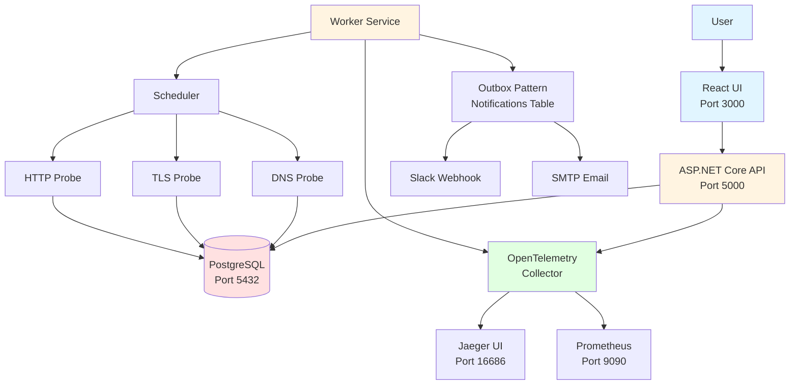

# DNS & TLS Observatory

A production-grade observability system for monitoring DNS health, TLS certificate status, and HTTP availability of domains. Built with .NET, React, and PostgreSQL, featuring enterprise patterns like outbox messaging, probe abstractions, and full OpenTelemetry observability.

## Architecture



## Key Features

- **DNS Monitoring**: A/AAAA/CNAME resolution, NXDOMAIN/SERVFAIL detection, resolution latency
- **TLS Monitoring**: Certificate expiry tracking, issuer validation, chain validation, handshake success/failure
- **HTTP Monitoring**: Status codes, TTFB, total latency, availability tracking
- **Incident Management**: Automatic incident creation/resolution, severity levels, timeline tracking
- **Alerting**: Slack webhooks and email notifications via outbox pattern (reliable delivery)
- **Observability**: Full OpenTelemetry integration (traces, metrics, logs)
- **Health Checks**: `/healthz` (liveness) and `/readyz` (readiness) endpoints

## Project Structure

```
observability_dns/
├── src/
│   ├── api/                    # ASP.NET Core Web API
│   ├── worker/                  # .NET Worker Service (scheduler + probes)
│   │   ├── Probers/            # Probe runner abstractions
│   │   └── Scheduler/          # Scheduling logic
│   ├── contracts/              # API contracts (DTOs, enums) - shared with UI
│   └── domain/                 # Domain models (DB entities, internal models)
├── ui/                          # React TypeScript frontend
├── infra/                       # Infrastructure as code
│   ├── database/                # Database setup and migrations
│   └── render/                 # Render deployment config
├── docs/                        # Documentation
└── tests/                       # Test projects
```

## Quick Start

### Prerequisites

- Docker and Docker Compose
- .NET 8 SDK (for local development)
- Node.js 18+ (for local UI development)

### Local Development

1. Clone the repository:
```bash
git clone <repository-url>
cd observability_dns
```

2. Start all services:
```bash
docker compose up -d
```

3. Access the services:
- UI: http://localhost:3000
- API: http://localhost:5000
- Jaeger UI: http://localhost:16686
- Prometheus: http://localhost:9090

4. Run database migrations (if needed):
```bash
docker compose --profile migrate up db-migrate
```

### Environment Variables

Create `.env` file or set environment variables:

```bash
# Database
ConnectionStrings__DefaultConnection=Host=postgres;Port=5432;Database=observability_dns;Username=observability;Password=observability_dev

# OpenTelemetry
OTEL_EXPORTER_OTLP_ENDPOINT=http://otel-collector:4317

# Slack (optional)
SLACK_WEBHOOK_URL=https://hooks.slack.com/services/YOUR/WEBHOOK/URL

# SMTP (optional)
SMTP_HOST=smtp.gmail.com
SMTP_PORT=587
SMTP_USERNAME=your-email@gmail.com
SMTP_PASSWORD=your-password
```

## Architecture Patterns

### Contracts/Domain Separation

- **Contracts** (`src/contracts/`): DTOs and enums shared between API and UI. Prevents DB schema changes from breaking the frontend.
- **Domain** (`src/domain/`): DB entities and internal domain models. Only used by API and Worker.

### Outbox Pattern

Notifications are written to the `notifications` table (outbox) before sending. A separate processor ensures reliable delivery with retry logic tracked in `notification_attempts`. This prevents lost alerts during failures.

### Probe Runners Abstraction

Clean `IProbeRunner` interface with separate implementations for DNS, TLS, and HTTP. Enables future multi-region expansion and easy testing.

## Deployment

See [docs/DEPLOYMENT.md](docs/DEPLOYMENT.md) for deployment instructions, including Render Blueprint configuration.

## Documentation

- [Architecture](docs/ARCHITECTURE.md) - Detailed architecture with diagrams
- [API Reference](docs/API.md) - API endpoint documentation
- [Setup Guide](docs/SETUP.md) - Step-by-step setup instructions
- [Deployment Guide](docs/DEPLOYMENT.md) - Deployment instructions

## Development Status

🚧 **In Development** - Project scaffolding complete. Implementation in progress.

### Next Steps

1. Implement domain CRUD operations
2. Build HTTP probe runner
3. Build DNS probe runner
4. Build TLS probe runner
5. Implement alerting and outbox processor
6. Add OpenTelemetry instrumentation
7. Build React dashboard

## License

MIT
