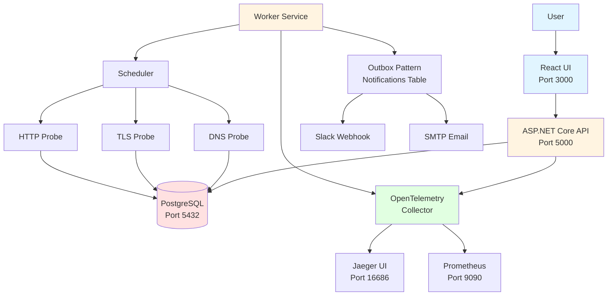

# DNS & TLS Observatory

A production-grade observability system for monitoring DNS health, TLS certificate status, and HTTP availability of domains. Built with .NET, React, and PostgreSQL, featuring enterprise patterns like outbox messaging, probe abstractions, and full OpenTelemetry observability.

## Architecture




## Key Features

- **DNS Monitoring**: A/AAAA/CNAME resolution, NXDOMAIN/SERVFAIL detection, resolution latency
- **TLS Monitoring**: Certificate expiry tracking, issuer validation, chain validation, handshake success/failure
- **HTTP Monitoring**: Status codes, TTFB, total latency, availability tracking
- **Incident Management**: Automatic incident creation/resolution, severity levels, timeline tracking
- **Alerting**: Slack webhooks and email notifications via outbox pattern (reliable delivery)
- **Observability**: Full OpenTelemetry integration (traces, metrics, logs)
- **Health Checks**: `/healthz` (liveness) and `/readyz` (readiness) endpoints

## Project Structure

```
observability_dns/
├── src/
│   ├── api/                    # ASP.NET Core Web API
│   ├── worker/                  # .NET Worker Service (scheduler + probes)
│   │   ├── Probers/            # Probe runner abstractions
│   │   └── Scheduler/          # Scheduling logic
│   ├── contracts/              # API contracts (DTOs, enums) - shared with UI
│   └── domain/                 # Domain models (DB entities, internal models)
├── ui/                          # React TypeScript frontend
├── infra/                       # Infrastructure as code
│   ├── database/                # Database setup and migrations
│   └── render/                 # Render deployment config
├── docs/                        # Documentation
└── tests/                       # Test projects
```

## Quick Start

### Prerequisites

- Docker and Docker Compose
- .NET 8 SDK (for local development)
- Node.js 18+ (for local UI development)

### Local Development

1. Clone the repository:
```bash
git clone <repository-url>
cd observability_dns
```

2. Start all services:
```bash
docker compose up -d
```

3. Check service status:
```bash
docker compose ps
```

4. Access the services:
- **UI Dashboard**: http://localhost:3000
- **API**: http://localhost:5000
- **API Health**: http://localhost:5000/healthz
- **API Swagger**: http://localhost:5000/swagger
- **Jaeger UI** (Traces): http://localhost:16686
- **Prometheus** (Metrics): http://localhost:9090

5. View logs:
```bash
# All services
docker compose logs -f

# Specific service
docker compose logs -f api
docker compose logs -f worker
docker compose logs -f ui
```

6. Run database migrations (if needed):
```bash
docker compose --profile migrate up db-migrate
```

### Manual Worker (Run Probe Jobs Manually)

The worker automatically schedules and runs probe jobs. To run probes manually (useful for testing):

#### Option 1: Using Manual Worker Service (Recommended)

Add to `docker-compose.yml`:
```yaml
manual-worker:
  build:
    context: .
    dockerfile: src/worker/Dockerfile
  environment:
    - ASPNETCORE_ENVIRONMENT=Development
    - ConnectionStrings__DefaultConnection=Host=postgres;Port=5432;Database=observability_dns;Username=observability;Password=observability_dev
    - MANUAL_WORKER_INTERVAL=30
    - USE_MANUAL_WORKER=true
  depends_on:
    postgres:
      condition: service_healthy
  command: ["dotnet", "ObservabilityDns.Worker.dll", "--use-manual-worker"]
```

Then run:
```bash
docker compose up manual-worker
```

#### Option 2: Using Shell Script

```bash
# Make script executable
chmod +x scripts/manual-worker.sh

# Run manually (requires psql and curl)
export DB_HOST=localhost
export DB_PORT=5432
export DB_NAME=observability_dns
export DB_USER=observability
export DB_PASSWORD=observability_dev
export CHECK_INTERVAL=30

./scripts/manual-worker.sh
```

#### Option 3: Execute Probe via API

```bash
# Get domain ID
DOMAIN_ID=$(curl -s http://localhost:5000/api/domains | jq -r '.[0].id')

# Trigger probe (will be executed by scheduled worker)
curl -X POST http://localhost:5000/api/probe-runs/trigger/$DOMAIN_ID
```

### Environment Variables

Create `.env` file or set environment variables:

```bash
# Database
ConnectionStrings__DefaultConnection=Host=postgres;Port=5432;Database=observability_dns;Username=observability;Password=observability_dev

# OpenTelemetry
OTEL_EXPORTER_OTLP_ENDPOINT=http://otel-collector:4317

# Slack (optional)
SLACK_WEBHOOK_URL=https://hooks.slack.com/services/YOUR/WEBHOOK/URL

# SMTP (optional)
SMTP_HOST=smtp.gmail.com
SMTP_PORT=587
SMTP_USERNAME=your-email@gmail.com
SMTP_PASSWORD=your-password
```

## Architecture Patterns

### Contracts/Domain Separation

- **Contracts** (`src/contracts/`): DTOs and enums shared between API and UI. Prevents DB schema changes from breaking the frontend.
- **Domain** (`src/domain/`): DB entities and internal domain models. Only used by API and Worker.

### Outbox Pattern

Notifications are written to the `notifications` table (outbox) before sending. A separate processor ensures reliable delivery with retry logic tracked in `notification_attempts`. This prevents lost alerts during failures.

### Probe Runners Abstraction

Clean `IProbeRunner` interface with separate implementations for DNS, TLS, and HTTP. Enables future multi-region expansion and easy testing.

## Deployment

See [docs/DEPLOYMENT.md](docs/DEPLOYMENT.md) for deployment instructions, including Render Blueprint configuration.

## Documentation

- [Architecture](docs/ARCHITECTURE.md) - Detailed architecture with diagrams
- [API Reference](docs/API.md) - API endpoint documentation
- [Setup Guide](docs/SETUP.md) - Step-by-step setup instructions
- [Deployment Guide](docs/DEPLOYMENT.md) - Deployment instructions

## Development Status

✅ **Fully Implemented** - Core features complete and functional.

### Completed Features

- ✅ Domain CRUD operations (Create, Read, Update, Delete)
- ✅ HTTP probe runner (status codes, TTFB, latency)
- ✅ DNS probe runner (A/AAAA records, resolution time)
- ✅ TLS probe runner (certificate validation, expiry tracking)
- ✅ Quartz scheduler (automatic probe execution)
- ✅ Outbox pattern (notification processor)
- ✅ OpenTelemetry integration (traces, metrics, logs)
- ✅ React dashboard with terminal-style UI
- ✅ Domain detail views with charts
- ✅ Incident management
- ✅ Health check endpoints

### Useful Commands

```bash
# Start all services
docker compose up -d

# Stop all services
docker compose down

# Restart specific service
docker compose restart api
docker compose restart worker

# Rebuild and restart
docker compose up -d --build

# View logs
docker compose logs -f api
docker compose logs -f worker

# Check API health
curl http://localhost:5000/healthz
curl http://localhost:5000/readyz

# List domains
curl http://localhost:5000/api/domains

# Get probe runs for a domain
curl "http://localhost:5000/api/probe-runs/domains/{domain-id}?limit=10"

# Access database
docker compose exec postgres psql -U observability -d observability_dns
```

### Manual Testing

1. **Add a domain**: Open UI at http://localhost:3000 and add a domain
2. **Check probe runs**: Worker automatically runs probes every N minutes (based on domain interval)
3. **View results**: Check the observability table or domain detail page
4. **View traces**: Open Jaeger UI at http://localhost:16686
5. **View metrics**: Open Prometheus at http://localhost:9090

## License

MIT
