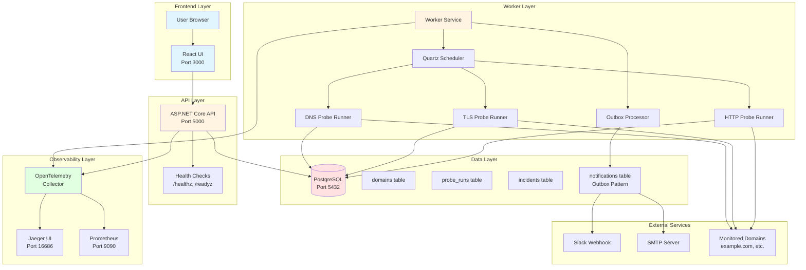

# Architecture Documentation

## System Overview

The DNS & TLS Observatory is a production-grade monitoring system built with a microservices architecture, featuring enterprise patterns for reliability, observability, and scalability.

## Architecture Diagram

## Component Details

### Frontend (React UI)

- **Technology**: React 18 + TypeScript + Vite
- **Purpose**: Dashboard for viewing monitoring data, incidents, and domain health
- **Communication**: REST API via `/api` proxy

### API (ASP.NET Core)

- **Technology**: .NET 8, ASP.NET Core Web API
- **Purpose**: 
  - Domain CRUD operations
  - Serving probe run results
  - Incident management
  - Health check endpoints
- **Health Checks**:
  - `/healthz`: Liveness probe (service is running)
  - `/readyz`: Readiness probe (database is accessible)

### Worker Service

- **Technology**: .NET 8 Worker Service + Quartz
- **Purpose**: 
  - Scheduled probe execution
  - Incident detection and resolution
  - Outbox pattern processing for alerts

#### Probe Runners

All probe runners implement `IProbeRunner` interface:

- **DNS Probe**: Resolves A/AAAA/CNAME records, tracks NXDOMAIN/SERVFAIL
- **TLS Probe**: Validates certificates, checks expiry, verifies chain
- **HTTP Probe**: Measures TTFB, total latency, status codes

#### Scheduler

- Uses Quartz.NET for job scheduling
- Supports intervals: 1, 5, 15 minutes
- Dynamic job creation based on domain configuration

### Database (PostgreSQL)

#### Core Tables

- **domains**: Monitored domains with interval settings
- **checks**: Check type configuration per domain
- **probe_runs**: Time-series data of probe execution results
- **incidents**: Open/closed incident tracking
- **alert_rules**: Alert trigger conditions

#### Outbox Pattern Tables

- **notifications**: Outbox table for reliable alert delivery
  - Status: PENDING → SENT/FAILED
  - Retry tracking via `retry_count`
- **notification_attempts**: Audit trail of delivery attempts

### Observability Stack

- **OpenTelemetry Collector**: Receives traces, metrics, logs
- **Jaeger**: Distributed tracing visualization
- **Prometheus**: Metrics collection and querying

## Design Patterns

### 1. Contracts/Domain Separation

**Problem**: DB schema changes should not break frontend.

**Solution**: 
- `contracts/`: DTOs and enums shared by API and UI
- `domain/`: DB entities only used by backend

**Benefit**: Frontend never depends on database structure.

### 2. Outbox Pattern

**Problem**: Sending alerts inline can lose messages during failures.

**Solution**:
1. Worker writes notification to `notifications` table (status: PENDING)
2. Separate outbox processor reads PENDING notifications
3. Sends alert (Slack/Email)
4. Updates status to SENT or FAILED
5. Retries failed notifications with exponential backoff

**Benefit**: Guaranteed delivery, no lost alerts.

### 3. Probe Runner Abstraction

**Problem**: Need to support multiple probe types and future multi-region expansion.

**Solution**: `IProbeRunner` interface with implementations:
- `IDnsProbeRunner`
- `ITlsProbeRunner`
- `IHttpProbeRunner`

**Benefit**: Easy to add new probe types, testable, enables multi-region.

### 4. Health Checks

**Liveness** (`/healthz`): Service is running
**Readiness** (`/readyz`): Service can handle requests (DB accessible)

Used by orchestration (Docker, Kubernetes, Render) for:
- Container restart on failure
- Load balancer routing
- Deployment health verification

## Data Flow

### Probe Execution Flow

1. Quartz scheduler triggers job based on domain interval
2. Worker loads domain and enabled checks from DB
3. For each check type:
   - Creates probe runner instance
   - Executes probe (DNS/TLS/HTTP)
   - Records result in `probe_runs` table
4. Evaluates alert rules
5. If threshold exceeded:
   - Creates/updates incident
   - Writes notification to outbox
6. Outbox processor sends alerts

### API Request Flow

1. User requests domain list via UI
2. UI calls `/api/domains`
3. API queries `domains` table
4. Returns DTOs (from contracts)
5. UI renders dashboard

## Scalability Considerations

### Current (Solo Dev MVP)

- Single worker instance
- Single database
- All probes run from one location

### Future Multi-Region

- Multiple worker instances (one per region)
- Probe runners can be deployed separately
- Shared database or read replicas
- Regional latency measurements

## Security

- Database credentials via environment variables
- API authentication (future: JWT/OAuth)
- SMTP credentials encrypted
- Slack webhook URLs stored securely

## Monitoring & Alerting

- **Self-Monitoring**: System monitors itself
- **OpenTelemetry**: Full observability stack
- **Health Checks**: Orchestration integration
- **Alerting**: Outbox pattern ensures delivery
